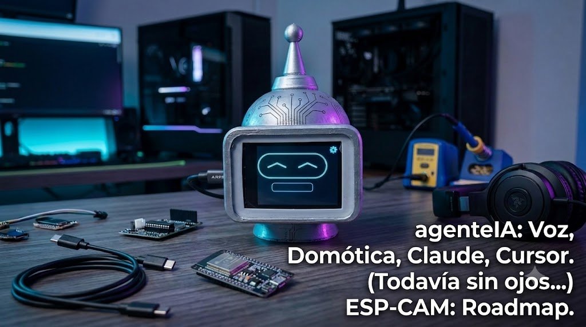
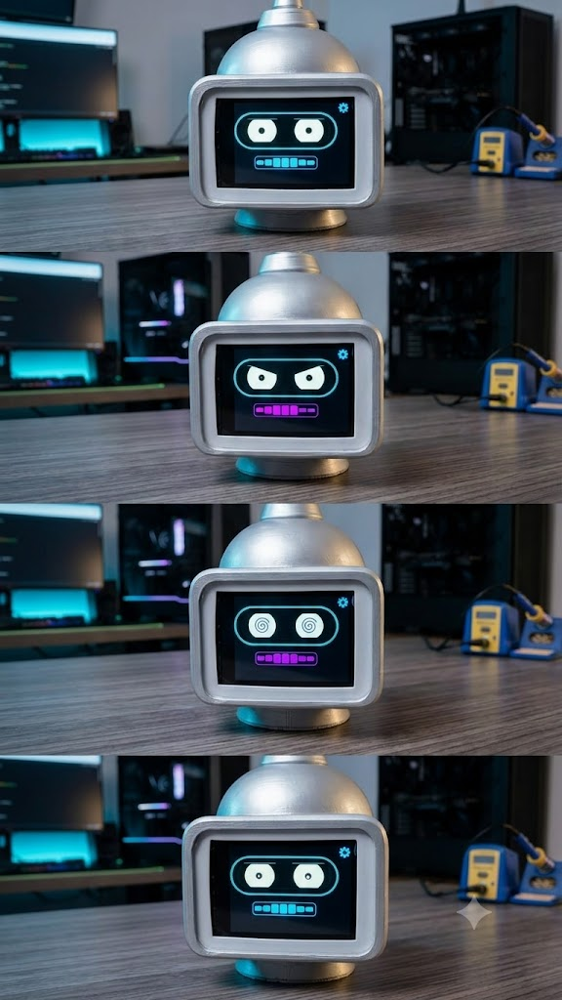

<!-- Language / Idioma: -->
**[Español](#-español) · [English](#-english)**

<p align="center">
  
</p>

<p align="center">
  <em>Voz · Domótica · Claude · Cursor · (todavía sin ojos — ESP-CAM en camino)</em>
</p>

---

# 🇪🇸 Español

# agenteIA — Personaje virtual con emociones

Cabeza impresa en 3D con pantalla de 2.8": **12 caras**, voz y actitud de Bender.
Una placa ESP32-S3 es la cara y los oídos; una PC en la red local corre el cerebro
(Whisper + Ollama + TTS). También avisa en voz alta cuando **Cursor** o **Claude**
se traba, piden permiso o te cortan el rate limit.

<p align="center">
  
</p>

```
ESP32-S3 (cara + oídos)               PC (cerebro)
├── Dibuja emociones en pantalla       ├── Servidor FastAPI (server/main.py)
├── Wake word "Hi ESP" (ESP-SR, local) ├── Whisper STT (audio -> texto)
├── Graba voz, hace POST del WAV ──────→├── Ollama (qwen2.5:7b) -> respuesta + emoción
└── Muestra respuesta + emoción ←──────┤── TTS (edge / Piper) -> voz
```

## Hardware

[Hosyond ES3C28P](https://us.amazon.com/dp/B0FKG7WRWV): ESP32-S3, 2.8" 240x320
IPS (ILI9341), táctil capacitivo FT6336, códec de audio ES8311 con micrófono MEMS,
salida de parlante, 16MB flash, OPI PSRAM. Esquemático y datasheets en
`docs/datasheets/`. Mapa de pines completo en `firmware/agente-ia/config.h`.

## Servidor (PC)

```powershell
cd server
.\start.ps1
```

`start.ps1` crea `.venv`, instala dependencias y levanta uvicorn. Requiere
**Ollama** corriendo con `qwen2.5:7b`. El TTS usa **edge-tts** (voz neural
`es-MX-DaliaNeural`, necesita internet) con fallback offline a **Piper** / SAPI.
Whisper usa GPU (CUDA) si está disponible, si no CPU.

Variables: `OLLAMA_URL`, `OLLAMA_MODEL`, `WHISPER_MODEL`, `WHISPER_DEVICE`,
`EDGE_TTS_VOICE`, `TTS_ENGINE` (`edge` | `sapi` | `piper`), `BRAIN_BIND_HOST`.

### Domótica (Home Assistant)

Opcional. El agente puede leer y controlar dispositivos de Home Assistant por voz
("prende la luz del estudio"). Copiá `server/secrets.local.ps1.example` a
`server/secrets.local.ps1` (gitignoreado) y poné tu `HA_URL` y un token de larga
duración en `HA_TOKEN`. Si no lo configurás, el agente funciona igual sin domótica.

## Firmware (Arduino IDE)

1. Instalá el core **esp32 by Espressif 3.x** (Gestor de placas).
2. Librerías: **LovyanGFX**, **ArduinoJson**.
3. Abrí **`firmware/agente-ia/agente-ia.ino`**.
4. Placa: **ESP32S3 Dev Module** — PSRAM **OPI PSRAM**, Flash **16MB**,
   Partición **ESP SR 16M (3MB APP/7MB SPIFFS/2.9MB MODEL)** (obligatoria para
   WakeNet; sin ella la placa entra en boot-loop con *Can not find model in partition table*).
5. Copiá `secrets.example.h` → `secrets.h` (WiFi + URL del servidor).

## Hooks de desarrollo (Cursor / Claude)

`POST /api/dev/notify` en el servidor: el robot habla y cambia de cara cuando el IDE
pide permiso, un agente termina, una tool falla o Anthropic te corta el rate limit.
Ideal para laburar con Cursor minimizado y que Bender te grite *"volvé al teclado"*.

## Estado

- [x] Cerebro: WAV -> Whisper -> Ollama -> `{emotion, reply}`
- [x] Cara: **12 emociones** con parpadeo y lip-sync
- [x] Micrófono ES8311 validado en hardware
- [x] Despertar por toque de pantalla
- [x] Voz de respuesta por el parlante (TTS)
- [x] Domótica opcional (Home Assistant)
- [x] Notificaciones Cursor / Claude → voz + emoción
- [ ] Wake word por voz estable ("Hi ESP")
- [ ] Visión (ESP-CAM — roadmap)

---

# 🇬🇧 English

# agenteIA — Virtual Character with Emotions

A 3D-printed head with a 2.8" display: **12 faces**, voice, and Bender attitude.
An ESP32-S3 board is the face and ears; a PC on the local network runs the brain
(Whisper + Ollama + TTS). It also speaks up when **Cursor** or **Claude** stalls,
asks for approval, or hits a rate limit.

<p align="center">
  
</p>

```
ESP32-S3 (face + ears)                PC (brain)
├── Paints emotions on screen          ├── FastAPI server (server/main.py)
├── Wake word "Hi ESP" (ESP-SR, local) ├── Whisper STT (audio -> text)
├── Records speech, POSTs the WAV ─────→├── Ollama (qwen2.5:7b) -> reply + emotion
└── Shows reply + emotion ←────────────┤── TTS (edge / Piper) -> voice
```

## Hardware

[Hosyond ES3C28P](https://us.amazon.com/dp/B0FKG7WRWV): ESP32-S3, 2.8" 240x320
IPS (ILI9341), FT6336 capacitive touch, ES8311 audio codec with MEMS mic,
speaker output, 16MB flash, OPI PSRAM. Schematic and datasheets in
`docs/datasheets/`. Full pin map in `firmware/agente-ia/config.h`.

## Server (PC)

```powershell
cd server
.\start.ps1
```

`start.ps1` creates `.venv`, installs deps and launches uvicorn. Requires
**Ollama** running `qwen2.5:7b`. TTS uses **edge-tts** (neural voice
`es-MX-DaliaNeural`, needs internet) with an offline **Piper** / SAPI fallback.
Whisper uses the GPU (CUDA) when available, otherwise CPU.

Env vars: `OLLAMA_URL`, `OLLAMA_MODEL`, `WHISPER_MODEL`, `WHISPER_DEVICE`,
`EDGE_TTS_VOICE`, `TTS_ENGINE` (`edge` | `sapi` | `piper`), `BRAIN_BIND_HOST`.

### Home automation (Home Assistant)

Optional. The agent can read and control Home Assistant devices by voice
("turn on the studio light"). Copy `server/secrets.local.ps1.example` to
`server/secrets.local.ps1` (gitignored) and set `HA_URL` and a long-lived
`HA_TOKEN`. Without it, the agent runs fine without home automation.

## Firmware (Arduino IDE)

1. Install the **esp32 by Espressif 3.x** core (Boards Manager).
2. Libraries: **LovyanGFX**, **ArduinoJson**.
3. Open **`firmware/agente-ia/agente-ia.ino`**.
4. Board: **ESP32S3 Dev Module** — PSRAM **OPI PSRAM**, Flash **16MB**,
   Partition **ESP SR 16M (3MB APP/7MB SPIFFS/2.9MB MODEL)** (required for
   WakeNet; without it the board boot-loops with *Can not find model in partition table*).
5. Copy `secrets.example.h` → `secrets.h` (WiFi + server URL).

## Dev hooks (Cursor / Claude)

`POST /api/dev/notify` on the server: the robot speaks and changes expression when the
IDE asks for permission, an agent finishes, a tool fails, or Anthropic rate-limits you.
Handy when Cursor is minimized and Bender yells *"get back to the keyboard"*.

## Status

- [x] Brain: WAV -> Whisper -> Ollama -> `{emotion, reply}`
- [x] Face: **12 emotions** with blinking and lip-sync
- [x] ES8311 mic validated on hardware
- [x] Touch-to-wake
- [x] Spoken reply through the speaker (TTS)
- [x] Optional home automation (Home Assistant)
- [x] Cursor / Claude notifications → voice + emotion
- [ ] Stable voice wake word ("Hi ESP")
- [ ] Vision (ESP-CAM — roadmap)

---

> Code, identifiers and comments are kept in English; this README is bilingual.
