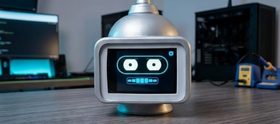
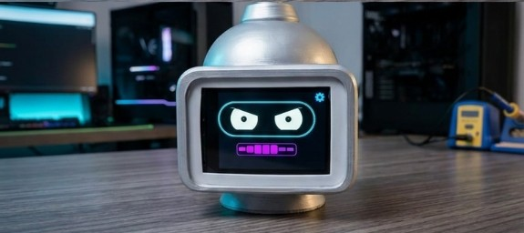
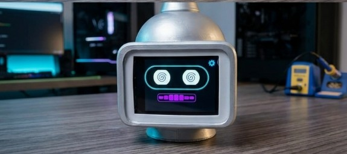
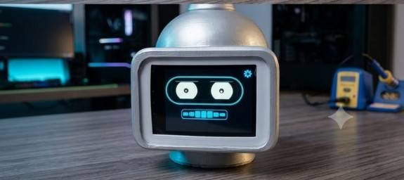

<!-- Language / Idioma: -->
**[Español](#-español) · [English](#-english)**

<p align="center">
  
</p>

<p align="center">
  <strong>ChatGPT con cuerpo</strong> · voz · cara · personalidad · domótica · Cursor · Claude<br>
  <em>(todavía sin ojos — ESP-CAM en camino)</em>
</p>

---

# 🇪🇸 Español

# agenteIA — Asistente conversacional con cara

Cabeza impresa en 3D con pantalla táctil de 2.8": **12 emociones**, voz de personaje (TTS + RVC) y actitud configurable.
Un ESP32-S3 es la cara y los oídos; una PC en la red local corre el cerebro (Whisper + Ollama + TTS).
Le hablas como a un asistente de IA — te responde **hablando**, con gestos y personalidad.

También **controla tu casa** (Home Assistant), **busca música** en YouTube, narra **historias con emociones sincronizadas** y te **avisa en voz alta** cuando **Cursor** o **Claude** se traba, piden permiso o te cortan el rate limit.

## Qué puede hacer

| Área | Ejemplos |
|------|----------|
| **Conversación** | Preguntas abiertas, chistes, consejos, hora, memoria de tu nombre |
| **Personalidades** | Bender, Burro, J.A.R.V.I.S., asistente amigable, técnico, compañero curioso |
| **Voz** | TTS (SAPI / Edge / Piper) + conversión RVC al timbre del personaje |
| **Domótica** | «Prende la luz del estudio», escenas, clima, «¿quién está en casa?» |
| **Música** | «Reproduce Pink Floyd» → suena en el parlante del robot (cara *vibing*) |
| **IDE** | Hooks → `POST /api/dev/notify` → voz + emoción cuando Cursor/Claude te necesita |
| **Táctil** | Despertar, caricia, golpe, menú de ajustes en pantalla |

## Emociones en pantalla

Parpadeo, mirada viva y boca al hablar. Prototipo real — cuatro caras del personaje:

<p align="center">
  
  
  
  
</p>

<p align="center"><sub>Neutral · Enojado · Mareado · Activo — 12 emociones en total (happy, sad, vibing, love…)</sub></p>

```
ESP32-S3 (cara + oídos)               PC (cerebro)
├── 12 emociones + lip-sync            ├── FastAPI (server/main.py)
├── Pantalla táctil + parlante         ├── Whisper → Ollama → emoción + texto
├── Graba voz, POST /converse ────────→├── TTS + RVC → voz del personaje
├── Música / modo historia ←───────────┤├── YouTube Music · Home Assistant
└── Panel web en http://IP/            └── Panel admin + hooks Cursor/Claude
```

## Hardware

[Hosyond ES3C28P](https://us.amazon.com/dp/B0FKG7WRWV): ESP32-S3, 2.8" 240×320 IPS (ILI9341), táctil FT6336, códec ES8311 (mic MEMS + parlante), 16MB flash, OPI PSRAM. Esquemático en `docs/datasheets/`. Pines en `firmware/agente-ia/config.h`.

## Servidor (PC)

```powershell
cd server
.\start.ps1
```

`start.ps1` crea `.venv`, instala dependencias y levanta uvicorn. Requiere **Ollama** (`qwen2.5:7b` por defecto). TTS: **edge-tts** (neural, internet) con fallback **Piper** / **SAPI**. Whisper en GPU (CUDA) si hay, si no CPU.

Variables: `OLLAMA_URL`, `OLLAMA_MODEL`, `WHISPER_MODEL`, `WHISPER_DEVICE`, `EDGE_TTS_VOICE`, `TTS_ENGINE`, `BRAIN_BIND_HOST`.

### Domótica (Home Assistant)

Opcional. Control por voz de luces, interruptores, escenas, clima y consulta de presencia. Copia `server/secrets.local.ps1.example` → `secrets.local.ps1` con `HA_URL` y `HA_TOKEN`. Sin HA, el resto funciona igual.

### Personalidades y voz

Panel web `/admin`: elegir preset, editar prompt, modelo Ollama, memoria, prueba de chat. Pestaña **Voz RVC**: timbre del personaje (Bender u otros modelos), tono e índice. Seis personalidades incluidas; voz guía configurable (Edge: Dalia, Jorge, Salomé, Elvira, Elena).

## Firmware (Arduino IDE)

1. Core **esp32 by Espressif 3.x**
2. Librerías: **LovyanGFX**, **ArduinoJson**
3. Sketch: **`firmware/agente-ia/agente-ia.ino`**
4. Placa: **ESP32S3 Dev Module** — PSRAM **OPI**, Flash **16MB**, partición **ESP SR 16M (3MB APP/7MB SPIFFS/2.9MB MODEL)**
5. `secrets.example.h` → `secrets.h` (WiFi + URL del servidor)

## Hooks Cursor / Claude

`POST /api/dev/notify`: el robot habla y cambia de cara cuando el IDE pide permiso, falla una tool, termina un subagente o hay rate limit. Ideal con Cursor minimizado — avisos físicos en la mesa, no solo un *ding* de Windows.

## Estado

- [x] Conversación IA + memoria + 6 personalidades editables
- [x] 12 emociones, lip-sync, efectos de sonido
- [x] TTS + RVC + canto opcional
- [x] Música por voz y panel web (YouTube)
- [x] Modo historia (audio + timeline de emociones)
- [x] Domótica opcional (Home Assistant)
- [x] Notificaciones Cursor / Claude
- [x] Paneles web (robot + cerebro)
- [ ] Wake word «Hi ESP» estable por voz
- [ ] Visión (ESP-CAM — roadmap)

---

# 🇬🇧 English

# agenteIA — Conversational assistant with a face

A 3D-printed head with a 2.8" touch display: **12 emotions**, character voice (TTS + RVC), and a configurable personality.
An ESP32-S3 is the face and ears; a PC on the local network runs the brain (Whisper + Ollama + TTS).
You talk to it like a conversational AI — it answers **out loud**, with expressions and attitude.

It also **controls your home** (Home Assistant), **streams music** from YouTube, plays **story mode** with synced emotions, and **speaks up** when **Cursor** or **Claude** stalls, asks for approval, or hits a rate limit.

## What it does

| Area | Examples |
|------|----------|
| **Conversation** | Open questions, jokes, advice, time, remembers your name |
| **Personalities** | Bender, Donkey, J.A.R.V.I.S., friendly assistant, concise tech, curious companion |
| **Voice** | TTS (SAPI / Edge / Piper) + RVC conversion to character timbre |
| **Home automation** | “Turn on the studio light”, scenes, climate, “who’s home?” |
| **Music** | “Play Pink Floyd” → plays on the robot speaker (*vibing* face) |
| **IDE** | Hooks → `POST /api/dev/notify` → voice + emotion when Cursor/Claude needs you |
| **Touch** | Wake, pet, poke, on-screen settings |

## On-screen emotions

Blinking, lively eyes, and lip-sync. Real prototype — four character faces:

<p align="center">
  
  
  
  
</p>

<p align="center"><sub>Neutral · Angry · Dizzy · Active — 12 emotions total (happy, sad, vibing, love…)</sub></p>

```
ESP32-S3 (face + ears)                 PC (brain)
├── 12 emotions + lip-sync             ├── FastAPI (server/main.py)
├── Touch display + speaker            ├── Whisper → Ollama → emotion + text
├── Records speech, POST /converse ───→├── TTS + RVC → character voice
├── Music / story mode ←───────────────┤├── YouTube Music · Home Assistant
└── Web panel at http://IP/            └── Admin panel + Cursor/Claude hooks
```

## Hardware

[Hosyond ES3C28P](https://us.amazon.com/dp/B0FKG7WRWV): ESP32-S3, 2.8" 240×320 IPS (ILI9341), FT6336 touch, ES8311 codec (MEMS mic + speaker), 16MB flash, OPI PSRAM. Schematic in `docs/datasheets/`. Pins in `firmware/agente-ia/config.h`.

## Server (PC)

```powershell
cd server
.\start.ps1
```

Creates `.venv`, installs deps, launches uvicorn. Requires **Ollama** (`qwen2.5:7b` default). TTS: **edge-tts** (neural, online) with **Piper** / **SAPI** fallback. Whisper on GPU (CUDA) when available.

Env: `OLLAMA_URL`, `OLLAMA_MODEL`, `WHISPER_MODEL`, `WHISPER_DEVICE`, `EDGE_TTS_VOICE`, `TTS_ENGINE`, `BRAIN_BIND_HOST`.

### Home automation (Home Assistant)

Optional. Voice control of lights, switches, scenes, climate, and presence queries. Copy `server/secrets.local.ps1.example` → `secrets.local.ps1` with `HA_URL` and `HA_TOKEN`.

### Personalities and voice

Web panel `/admin`: pick preset, edit prompt, Ollama model, memory, test chat. **RVC voice** tab: character timbre (Bender or other models), pitch and index. Six built-in personalities; guide voice via Edge (Dalia, Jorge, Salomé, Elvira, Elena).

## Firmware (Arduino IDE)

1. **esp32 by Espressif 3.x** core
2. Libraries: **LovyanGFX**, **ArduinoJson**
3. Sketch: **`firmware/agente-ia/agente-ia.ino`**
4. Board: **ESP32S3 Dev Module** — **OPI** PSRAM, **16MB** flash, **ESP SR 16M** partition
5. `secrets.example.h` → `secrets.h` (WiFi + server URL)

## Cursor / Claude hooks

`POST /api/dev/notify`: the robot speaks and changes expression when the IDE asks for permission, a tool fails, a subagent finishes, or rate limit hits. Handy with Cursor minimized — physical alerts on your desk, not just a Windows *ding*.

## Status

- [x] AI conversation + memory + 6 editable personalities
- [x] 12 emotions, lip-sync, sound effects
- [x] TTS + RVC + optional singing
- [x] Voice and web-panel music (YouTube)
- [x] Story mode (audio + emotion timeline)
- [x] Optional home automation (Home Assistant)
- [x] Cursor / Claude notifications
- [x] Web panels (device + brain)
- [ ] Stable voice wake word (“Hi ESP”)
- [ ] Vision (ESP-CAM — roadmap)

---

> Code, identifiers and comments are kept in English; this README is bilingual.
